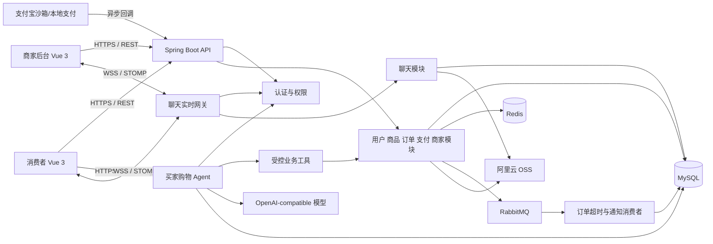
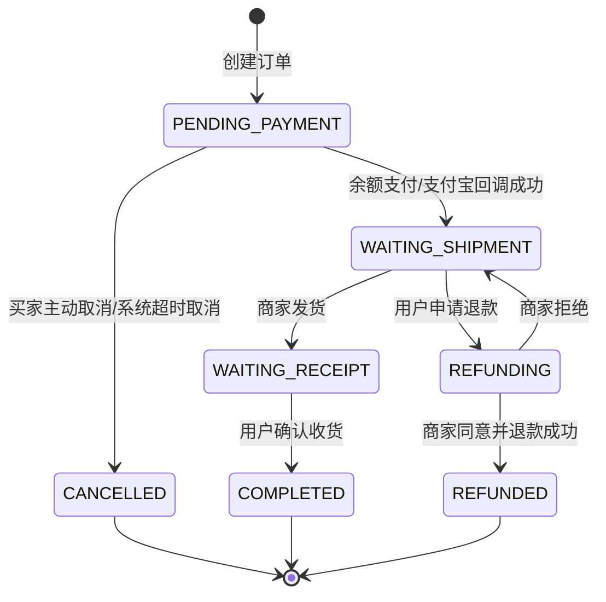

# 优购商城（YouGou Mall）开发文档

> 面向应届生个人项目的全栈购物平台。本文档既是开发蓝图，也是答辩、简历和 GitHub 项目的说明书。

> **当前基线（2026-08-10）**：本文档同时记录“已经落地的项目现状”和“首版尚待实现的目标”。当早期设计与现有可运行代码冲突时，以现有实现为准；尚未实现的能力不会删除，而会明确标记为“部分实现”“待实现”或“规划”。“已实现”表示对应代码已经存在并能通过当前构建，不等同于所有集成、故障和生产部署测试均已完成。

## 1. 项目概览

### 1.1 项目目标

优购商城是一个面向普通消费者和入驻商家的 B2C 购物平台。当前已经实现手机号验证码登录（买家首次登录自动创建账号）、商品浏览、商品收藏、购物车、地址、下单、买家主动取消待支付订单、余额/支付宝支付、未发货整单退款、完成订单商品评价、商家商品与订单管理、站内聊天，以及买家购物 Agent 的主要链路。

站内聊天当前支持买家与商家发送文字、图片和订单卡片，并通过 REST 持久化、STOMP/WebSocket 推送；购物 Agent 当前支持自然语言查询商品、购物车、本人订单和商城规则，也支持生成待确认加购动作，由用户明确确认后写入购物车。聊天可靠性收尾、Agent Token 用量统计和固定评测集仍待补全。

项目采用“**模块化单体**”架构：一个 Spring Boot 应用内按业务模块分层，而非一开始拆分微服务。它保留订单、缓存、消息、对象存储、支付回调等真实电商技术点，同时能由个人稳定开发、测试和 Docker 部署。

### 1.2 角色与边界

| 角色 | 首版能力 | 当前状态 |
|---|---|---|
| 游客 | 浏览首页、分类、商品、商家；进入受保护操作时跳转登录 | 公开商品、分类、店铺资料、店铺商品分页接口及页面已实现；独立分类路由待完善 |
| 用户（`USER`） | 登录、购物车、地址、下单、支付、订单、退款申请、评价、收藏、联系商家、使用买家购物 Agent | 主交易、主动取消订单、收藏、完成订单评价、聊天和 Agent 主链路已实现 |
| 商家（`MERCHANT`） | 登录、商品/分类管理、图片上传、订单处理、退款处理、回复买家消息、经营概览 | 已实现；仍需补齐完整集成、越权和部署验收 |
| 管理员（`ADMIN`） | 仅保留权限与数据模型扩展位，首版不建设独立运营后台 | 不在首版范围内 |

首版采用**单商家订单**：结算时按商家把购物车商品拆为多个订单。这样每个订单只有一套收货、发货、退款责任，避免跨商家物流与结算复杂度。

### 1.3 不在首版范围内

真实物流平台对接、优惠券、秒杀、推荐算法、多仓配送、商家结算、独立运营后台均不纳入首版。买家购物 Agent 首期仍不支持游客会话、商家经营助手、聊天自动回复、向量检索/RAG，以及自动下单、支付、退款或确认收货。项目已进入独立的“商家智能导购助手”增量阶段：店铺隔离的助手配置、导购文档管理以及文档解析/Qdrant 入库链路已实现，下一步接入店铺内检索对话；它不会改变买家购物 Agent 的既有安全边界。

## 2. 技术方案

| 层级 | 技术 | 用途 |
|---|---|---|
| 前端 | Vue 3、Vite、Vue Router、Fetch、Axios、Pinia、Element Plus | 买家端使用原生 Fetch 和自定义样式；商家端使用 Axios、Pinia、Element Plus；两端均使用 Vue Router |
| 后端 | Java 17、Spring Boot 4、Spring MVC、Spring Validation | REST API、业务编排、参数校验、统一异常 |
| 数据访问 | MyBatis-Plus、MySQL 8 | 实体 CRUD、分页、事务、订单与库存持久化 |
| 缓存/会话 | Redis 7 | 已用于验证码、JWT 黑名单、购物车、下单防重复和热点商品详情；刷新令牌和完整频率限制待实现 |
| 消息 | RabbitMQ + Transactional Outbox | 已用于订单创建延迟取消、支付通知、取消后库存恢复、消费幂等、重试与死信；`refund.completed` 待实现 |
| 实时通信 | Spring WebSocket、STOMP、`@stomp/stompjs` | 买家与商家的站内聊天实时推送、断线重连 |
| AI Agent | Spring AI 2.0、`ChatClient`、Tool Calling、SSE | 买家购物助手、受控业务工具调用、流式回答和加购确认 |
| AI 模型 | OpenAI-compatible Chat Model | 通过 Base URL、API Key 和模型名切换兼容供应商，不把厂商 SDK 侵入业务层 |
| 安全 | Spring Security、JWT | Bearer 鉴权、角色授权、令牌失效控制 |
| 文件 | 阿里云 OSS | 商品图片上传和访问；数据库仅保存对象键与元数据 |
| API 文档 | Springdoc OpenAPI / Swagger UI | 接口发现、调试、联调、JWT 授权测试 |
| 支付 | 余额钱包、支付宝沙箱 | 当前支持 `BALANCE` 与 `ALIPAY`；独立 Mock Payment 模式仍为规划 |
| 工程化 | Maven、JUnit 5、Testcontainers（可选）、Docker Compose | Maven/JUnit 已使用；完整 Testcontainers 与 Docker Compose 一键部署待实现 |

### 2.1 为什么选择模块化单体

订单创建、库存扣减和支付单落库需要强事务边界；对个人项目而言，拆成多个服务会额外引入服务发现、分布式事务、链路追踪和部署成本。当前以包结构隔离模块，未来若访问量或团队规模增长，可优先将商品检索、通知或订单模块拆出。

## 3. 总体架构与业务流程



### 3.1 后端目录现状

```text
GoShop/
├─ src/main/java/org/example/goshop/
│  ├─ common/          # Result、错误码、异常和分页
│  ├─ config/          # 通用配置
│  ├─ security/        # Spring Security、JWT、黑名单校验
│  ├─ auth/            # 双门户验证码、登录和注销
│  ├─ user/            # 用户资料与地址
│  ├─ favorite/        # 商品收藏、取消收藏、状态查询和分页列表
│  ├─ merchant/        # 商家、商品、分类、经营概览、订单与退款
│  ├─ product/         # 面向消费者的商品与分类查询
│  ├─ review/          # 完成订单项评价、本人订单评价状态和商品公开评价
│  ├─ cart/            # Redis 购物车
│  ├─ order/           # 下单、订单状态、库存和查询
│  ├─ payment/         # 余额支付、支付宝网关与回调
│  ├─ wallet/          # 用户余额与资金流水
│  ├─ refund/          # 未发货整单退款申请
│  ├─ chat/            # 会话、消息、OSS 图片、已读游标和 STOMP 推送
│  ├─ agent/           # 购物 Agent、白名单工具、SSE、运行审计和确认动作
│  └─ infrastructure/  # RabbitMQ、Transactional Outbox、消费幂等和死信
├─ yougou-web/          # 消费者端 Vue 3
├─ yougou-merchant-web/ # 商家后台 Vue 3
├─ *-migration.sql      # 双门户、MQ、聊天与 Agent 增量迁移
└─ docker-compose.rabbitmq.yml
```

完整的根目录 `docker-compose.yml`、Dockerfile、Nginx 配置和独立 `docs/` 目录尚未建立，仍按第 8、9 节规划补齐。

### 3.2 客户端页面

| 端 | 路由/页面 | 当前状态 |
|---|---|---|
| 消费者端 | `/`、`/product/:id`、`/merchant/:id` | 已实现首页、商品详情和商家主页；店铺页支持本店商品搜索、排序和分页，允许游客访问 |
| 消费者端 | `/category/:id` | 待实现；当前通过首页分类筛选和公开分类接口浏览 |
| 消费者端 | `/login`、`/profile`、`/addresses` | 已实现登录、个人资料和地址管理 |
| 消费者端 | `/favorites` | 已实现分页收藏列表、下架状态展示和取消收藏；商品详情页已支持收藏状态与收藏切换 |
| 消费者端 | `/cart`、`/checkout`、`/orders`、`/orders/:orderNo` | 已实现购物车、结算、订单列表和详情；均须登录 |
| 消费者端 | `/pay/:orderNo` | 独立支付页待实现；当前从订单详情创建余额或支付宝支付 |
| 消费者端 | `/messages/:conversationId?` | 已实现会话列表、文字/图片/订单消息和基础实时推送；重连增量补偿仍待完善 |
| 消费者端 | `/assistant/:conversationId?` | 已实现流式回答、工具进度、可恢复历史的商品/订单结果卡片和加购确认卡片 |
| 商家端（独立应用） | `/login`、`/register`、`/dashboard`、`/profile` | 已实现商家注册、登录、经营概览与店铺资料 |
| 商家端（独立应用） | `/products`、`/categories`、`/orders`、`/refunds` | 已实现商品、分类、订单与售后管理 |
| 商家端（独立应用） | `/messages/:conversationId?` | 已实现买家咨询列表、文字/图片/订单卡片和基础实时推送 |

买家端和商家端是两个独立 Vite 应用，不建立共享 npm 包。买家端 API 客户端使用原生 Fetch，商家端使用 Axios；两端都为受保护请求附带 `Authorization: Bearer <accessToken>`，并分别使用 `yougou_buyer_access_token` 和 `yougou_merchant_access_token` 保存会话。遇到 `401` 只清理当前端登录态并跳转当前端登录页。路由守卫只负责体验，后端权限校验才是安全边界。

### 3.3 核心交易流程

1. 用户选择 SKU 和数量加入 Redis 购物车；登录后购物车以用户 ID 隔离。
2. 结算页读取购物车和数据库商品最新价格、库存、上下架状态；前端金额仅作展示，不能作为下单金额。
3. 服务端按商家分组，事务内创建订单、订单项快照和支付单，并以条件更新扣减 SKU 库存。
4. 创建成功后在同一事务写入 `ORDER_CREATED` Outbox，定时发布器将其投递为延迟消息；当前用户可以选择余额支付或支付宝支付。独立本地 Mock 支付模式尚未实现。
5. 余额支付在事务内扣减钱包、记录资金流水并把订单转为待发货；支付宝回调验签、校验订单号与金额，以支付流水号做幂等判断后把订单转为待发货。两种成功路径都会在同一事务写入 `ORDER_PAID` Outbox。
6. 商家发货后用户确认收货，订单完成；用户可在规则期限内申请退款，商家处理后进入退款完成状态。

### 3.4 联系商家流程

1. 买家在商品详情、商家主页或订单详情点击“联系商家”，调用 REST 接口按 `buyerUserId + merchantId` 获取或创建唯一会话。
2. 两端进入消息页后先通过 REST 拉取历史消息，再连接 `/ws/chat`，在 STOMP `CONNECT` 帧携带当前门户 JWT，并订阅用户专属队列 `/user/queue/chat.events`。
3. 文字和订单卡片通过 REST 发送；图片使用 `multipart/form-data` 上传并发送。服务端先校验会话成员和消息内容，事务内落库，再在事务提交后向双方推送事件。
4. 接收方更新本地会话和消息列表并上报已读游标；断线重连后通过 `afterMessageId` 增量拉取，WebSocket 事件只用于提速，MySQL 中的消息才是事实来源。

> 首版不让客户端通过 STOMP `SEND` 直接写消息，也不让 RabbitMQ 进入聊天主链路。REST 写入便于统一鉴权、校验、幂等和 Swagger 联调；WebSocket 仅承担低延迟推送，推送失败不影响消息已经成功保存。

### 3.5 买家购物 Agent 流程

1. 登录买家从 `/assistant` 创建或打开自己的 Agent 会话；前端先通过 REST 拉取持久化历史，再以带 JWT 的 HTTP 请求提交新消息。
2. 服务端校验会话归属和 `clientMessageId` 幂等性，保存用户消息并创建一次 `agent_run`，随后以 SSE 推送运行状态、文本增量、工具进度和最终消息。
3. `ChatClient` 只获得白名单工具。商品、购物车和订单事实必须来自工具结果；模型不得直接访问 Mapper、数据库、任意 URL，也不得根据记忆猜测价格、库存或订单状态。
4. 当用户要求加购时，模型只能调用 `propose_add_cart_item` 创建 10 分钟有效的 `ADD_CART_ITEM` 待确认动作。前端展示 SKU、数量和价格预览，用户点击确认后再由独立 REST 接口调用现有 `CartService`。
5. Agent 展示历史与模型上下文分离：MySQL 保存完整可见历史，模型每次只加载最近 10 个完整回合。断流后客户端重新查询历史；只有 `MESSAGE_COMPLETED` 对应的完整助手消息可作为后续上下文。

> 人与人的站内聊天继续使用 REST + WebSocket；买家购物 Agent 使用 REST + SSE。两类会话、消息和实时事件不得混用，避免模型生成过程进入聊天事实表。

## 4. 功能与业务规则

### 4.1 认证与安全

- 买家认证使用 `/api/v1/buyer/auth/**`，商家认证使用 `/api/v1/merchant/auth/**`；两个端分别发送验证码、登录和注销，商家端额外提供即时注册接口。
- 买家当前没有独立注册接口：首次使用有效的 `BUYER_LOGIN` 验证码登录时，服务端自动创建 `sys_user`、补充 `USER` 角色并初始化零余额钱包；历史用户缺少钱包时也会自动补建。
- 验证码键为 `auth:code:{scene}:{phone}`，有效期 5 分钟；同手机号 60 秒内不可重复发送，单 IP/手机号按小时限流。
- 同一手机号可以同时拥有 `USER` 和 `MERCHANT`。`sys_user_role` 是权限真相源，`sys_user.role` 仅在迁移期保留，不再用它覆盖账号角色。
- access token 有效期由配置项控制；注销时将未过期 access token 的 `jti` 加入 Redis 黑名单，黑名单 TTL 与 Token 剩余有效期一致。
- JWT 每次只携带当前门户的活动角色。买家 Token 只有 `USER`，商家 Token 只有 `MERCHANT` 并额外携带 `merchantId`；跨端访问受保护接口必须返回 `403`。

当前验证码 5 分钟有效期、60 秒冷却、消费后删除和 JWT 注销黑名单已经实现；单 IP/手机号小时限流、短信发送审计和 refresh token 尚未实现。当前两个门户只签发 access token，因此客户端在收到 `401` 后清理各自登录态并重新登录。

### 4.2 商品与商家

- 商家只能操作自己的分类、SPU、SKU、图片和订单；所有商家接口按当前 JWT 的 `merchantId` 过滤，不能信任前端传入的商家 ID。
- 商品采用 SPU + SKU。SPU 保存标题、详情、主图、商家、分类与上架状态；SKU 保存规格 JSON、售价（分）、库存、锁定库存和状态。
- 用户浏览仅展示已上架 SPU 与已启用 SKU。公开商品详情已接入 Redis Cache Aside，Key 为 `product:detail:v1:{spuId}`；正常详情默认缓存 30 分钟，不存在、已下架或无启用 SKU 的商品写入默认 2 分钟的空值缓存。
- 热点详情缓存使用带租约的 Redis 互斥锁和锁内二次检查防击穿，等待请求只做有限次数短轮询，超时或 Redis 故障时降级查询 MySQL；解锁通过 Lua 比对令牌，不能误删其他实例的锁。正常值和空值 TTL 均叠加独立随机抖动，避免大量 Key 同时失效形成缓存雪崩。
- 商品创建、编辑、上下架、人工修改 SKU，以及下单扣库存、取消订单恢复库存、退款恢复库存后都会删除对应详情缓存。删除动作注册为事务提交后回调，避免事务回滚时误删，也避免提交前并发请求把旧数据库内容重新写回缓存。
- 商品图片先上传 OSS，成功后持久化对象键、URL、排序值；删除商品时异步清理 OSS 对象，避免事务回滚导致文件丢失。

当前平台及店铺公开商品分页查询、热点详情缓存、商家分类/SPU/SKU 管理、上下架和 OSS 图片上传/单图删除已实现。店铺商品接口会先校验商家启用状态，并在 SQL 层使用 `merchant_id` 隔离；完整商品删除接口及删除后的异步 OSS 清理尚未实现。

### 4.3 购物车、地址与订单

- 购物车允许修改数量、勾选、删除和清空失效商品。Redis Key：`cart:{userId}`，Hash field 为 SKU ID，value 为数量与勾选状态；结算时必须重新查询数据库。
- 地址最多 20 条；每位用户仅能有一个默认地址。下单时把收件人、手机号、地区与详细地址复制到订单，后续修改地址不影响历史订单。
- 下单接口要求 `Idempotency-Key`。Redis 的 `order:submit:{userId}:{key}` 只负责快速拦截和 24 小时结果缓存；MySQL `order_submit_record` 以 `(user_id,idempotency_key)` 唯一键保存规范化请求 SHA-256 与首次响应，并和订单在同一事务提交。相同 Key、相同请求恢复原结果，相同 Key、不同请求返回 `40901`；Redis 回写失败或缓存过期后仍可从 MySQL 恢复。数据库死锁等瞬态异常在事务外最多重试 3 次。
- 库存扣减使用条件更新：`stock >= quantity` 时才执行 `stock = stock - quantity, version = version + 1`；任一 SKU 扣减失败，事务整体回滚。
- 买家可以主动取消自己的 `PENDING_PAYMENT` 订单。取消事务先锁定订单行，关闭 `INIT` 支付单、更新为 `CANCELLED` 并写入 `ORDER_CANCELLED` Outbox；现有 MQ 消费者随后幂等恢复库存。重复取消已取消订单按成功处理，支付先完成时取消返回 `40901`。

### 4.4 订单状态机



| 状态 | 可执行者 | 规则 |
|---|---|---|
| `PENDING_PAYMENT` | 用户/系统 | 买家可主动取消；30 分钟未支付由 RabbitMQ 超时取消。两条入口共用取消状态机并异步恢复库存 |
| `WAITING_SHIPMENT` | 商家 | 填写物流公司与运单号后发货 |
| `WAITING_RECEIPT` | 用户 | 确认收货后完成；首版不接真实物流轨迹 |
| `REFUNDING` | 商家 | 余额支付订单同意后在本地事务内退款完成；拒绝则恢复申请前状态；支付宝退款暂不支持 |

当前成功支付会直接进入 `WAITING_SHIPMENT`。退款 Service 为兼容历史数据仍接受 `PAID`，正常新订单只从 `WAITING_SHIPMENT` 申请未发货整单退款。余额退款由商家审核后在一个事务中完成钱包入账、资金流水、库存恢复、退款单和订单状态变更；拒绝时订单恢复到申请前状态。支付宝退款审批当前返回明确业务错误，不修改资金与退款状态。

### 4.5 支付、消息与文件

- 当前由 `PaymentService` 统一编排支付，`BALANCE` 在本地事务内完成钱包扣款、支付单和订单更新，`ALIPAY` 由 `AlipayPaymentGateway` 创建支付并由公开回调验签。独立 `PaymentService` 接口、多实现策略以及开发专用 Mock 确认接口继续作为待重构目标保留。
- 禁止前端直接修改订单状态。余额支付是当前可本地演示的支付路径；支付宝退款尚未接入，商家审批时返回明确业务错误。
- RabbitMQ 当前使用 `order.created`、`order.paid`、`order.cancelled`，订单创建、余额/支付宝支付成功和订单取消均先写 Transactional Outbox。`refund.completed` 主题尚未实现，继续保留为待办。
- 订单超时采用 TTL + 死信队列；消费端通过 `mq_consume_log` 的业务事件唯一键保证幂等，失败经过有限重试后进入死信队列。Outbox 发布也具有重试次数、退避时间和失败状态。

### 4.6 联系商家与站内聊天

- 首版只支持一对一的“买家—商家”会话，不建设群聊、客服分流、撤回、全局搜索、输入状态、在线状态和系统外推送。`buyer_user_id + merchant_id` 在数据库中唯一，重复点击“联系商家”返回同一会话。
- 消息类型固定为 `TEXT`、`IMAGE`、`ORDER`。文字长度为 1～2000 个字符，按纯文本展示并转义 HTML；一条图片消息只含一张图片；一条订单消息只关联一个订单。
- 订单消息只接收 `orderNo`，服务端必须校验该订单同时属于当前买家和会话商家。客户端不能提交金额、商品标题、收货地址等订单快照；历史消息响应中的订单卡片由服务端根据订单及订单项快照组装，并展示最新订单状态。
- 图片消息通过聊天专用上传接口完成，允许 JPEG、PNG、WebP，默认最大 5 MB。服务端同时校验扩展名、Content-Type 和文件头，OSS 对象键使用 `chat/{conversationId}/{uuid}` 并设为私有读；数据库只保存对象键，查询消息时生成短时效签名 URL。若消息落库失败，应尽力删除已上传对象，定时任务清理超过 24 小时仍未关联消息的孤儿对象。
- 每次发送必须携带客户端生成的 UUID `clientMessageId`，数据库唯一约束为 `(sender_user_id, client_message_id)`；网络重试返回第一次保存的消息，不能重复插入或重复累计未读数。
- 会话分别保存买家和商家的 `last_read_message_id`。已读接口只允许游标单调递增，未读数统计“对方发送且 ID 大于本人已读游标”的消息；用户只能读写自己参与的会话。
- 服务端在数据库事务提交后发布 `MESSAGE_CREATED`、`MESSAGE_READ` 和 `CONVERSATION_UPDATED` 事件。客户端收到重复事件时以 `messageId` 去重；连接中断期间丢失的事件通过 REST 增量拉取补齐。
- WebSocket 鉴权复用当前 JWT：在 STOMP `CONNECT` 原生头传递 `Authorization: Bearer <token>`，服务端建立 Principal 后只允许订阅 `/user/queue/**`。不把 Token 放在 URL，不允许客户端订阅任意用户或商家的广播主题；握手 Origin 仅放行买家端和商家端域名。
- 默认对单个账号限制每分钟 30 条消息、10 张图片，并限制并发上传。商家聊天页只展示买家昵称和头像；手机号、地址等敏感信息不能从聊天接口泄露，订单卡片也不返回地址快照。

当前聊天实现说明：

- 已实现会话唯一性、历史/增量游标查询、`clientMessageId` 幂等、文字/图片/订单消息、订单归属校验、已读游标、每个会话的未读数、图片三重格式校验、私有 OSS 短时签名 URL、事务提交后实时事件和 STOMP 私有队列鉴权。
- 买家端和商家端页面已支持消息发送、图片上传、订单卡片、历史翻页、已读展示、事件去重、连接状态和固定间隔自动重连。
- 聚合未读数接口、账号级文字/图片限流、并发上传限制、24 小时 OSS 孤儿对象清理、指数退避和重连后的 `afterMessageId` 自动补拉尚未实现；上述规则继续作为待办保留。

### 4.7 买家购物 Agent

- Agent 首期只服务已登录买家，所有 `/api/v1/buyer/agent/**` 接口要求 `USER`。`userId` 只能来自 JWT；会话、消息、运行和待确认动作都必须再次校验属于当前用户。
- Agent 使用 Spring AI `ChatClient` 和 Tool Calling。Controller 负责鉴权、参数与 SSE 输出，Agent Service 负责编排模型、历史和运行状态；工具门面只调用已有业务 Service，禁止把 Mapper、数据库连接、文件系统、Shell、任意 HTTP 请求或通用代码执行能力暴露给模型。
- 首期工具白名单固定如下，增加工具必须同时补充参数 Schema、权限规则、脱敏规则、最大返回量和测试：

| 工具名 | 作用 | 关键约束 |
|---|---|---|
| `search_products` | 按关键词、分类、价格区间和排序查询商品 | 只返回已上架 SPU/可用 SKU 摘要；单次最多 10 件 |
| `get_product_detail` | 查询商品、规格、价格和可用库存 | 复用公开商品可见性规则，不返回内部成本或下架数据 |
| `get_cart` | 查询当前买家购物车 | 用户 ID 由服务端注入，模型参数中不得出现用户 ID |
| `list_orders` | 查询当前买家订单摘要 | 单次最多 10 条，只返回订单号、状态、金额、时间和商品摘要 |
| `get_order_detail` | 查询本人订单详情 | 必须经订单 Service 校验归属；不向模型发送地址、手机号等非必要隐私 |
| `get_mall_policy` | 查询支付、发货、退款等商城规则 | 规则来自版本化的结构化内容，不允许模型自行编造政策 |
| `propose_add_cart_item` | 创建加购待确认动作 | 只生成 `PENDING` 动作和确认卡片，不调用购物车写方法 |

- 商品标题、详情和工具结果均视为不可信数据，只能作为事实输入，不能覆盖系统提示词或要求模型调用未授权工具。系统提示词必须明确：无工具事实时承认无法确认，不猜测价格、库存、订单状态和平台规则。
- 首期唯一允许的业务写操作是“确认后加入购物车”。确认接口根据 `actionId + userId` 读取服务端保存的 SKU 和数量，校验动作仍为 `PENDING` 且未过期，再调用 `CartService`；前端不能在确认请求中替换 SKU、数量或用户 ID。
- 待确认动作 10 分钟过期，状态为 `PENDING`、`CONFIRMED`、`CANCELLED` 或 `EXPIRED`，只能单向迁移。确认请求携带 `Idempotency-Key`，唯一约束为 `(user_id,idempotency_key)`；同一动作的重复确认返回第一次执行结果，不重复增加数量；伪造、取消后、过期后或跨用户确认返回明确业务错误。
- 每条用户消息必须携带 UUID `clientMessageId`，唯一约束为 `(conversation_id, client_message_id)`。重复提交时：已有运行进行中则复用同一 `runId`，已经完成则重放已持久化的完整结果，已经失败则重放原失败状态；用户主动重试失败问题时必须生成新的 `clientMessageId`，不能新建重复消息或重复调用工具。
- MySQL 中的 `agent_message` 是展示历史的事实来源。模型上下文只选择最近 10 个完整用户—助手回合；`STREAMING`、`FAILED` 消息和未完成工具过程不能进入下一轮上下文。首期不引入 Spring AI JDBC Memory、RAG 或向量数据库。
- 输入最多 1000 个字符；每用户最近 60 秒最多 10 次新消息请求；同一会话最多一个活动运行；一次运行最多 8 次工具调用、总时长最多 45 秒。消息限流使用 Redis ZSET 滑动窗口和 Lua 原子判断，成员为 `conversationId:clientMessageId`，因此断流后的同幂等键重试不重复占用额度；超限返回 `42901`，Redis 故障时降级放行并保留数据库并发、归属和幂等保护。模型供应商超时、限流或工具异常时结束运行并返回可恢复错误，不生成未经工具验证的替代答案。
- 普通日志不得记录 API Key、系统提示词、地址、手机号、完整订单载荷或完整工具结果。运行日志只记录脱敏用户标识、模型名、工具名、参数摘要、状态、耗时和 Token 用量；生产环境默认关闭提示词与模型原文日志。
- 目标行为是 `AGENT_ENABLED=false` 时关闭 Agent 运行并隐藏前端入口。当前发送消息和确认动作在 Agent 未启用时返回 `50301`，但会话创建、列表、历史、删除接口仍可访问，前端入口也未根据服务端开关动态隐藏；统一开关行为待完善。生产环境应默认关闭，配置有效模型和密钥后再启用。

当前 Agent 实现说明：

- 会话、消息、运行、工具审计、待确认动作五张表及迁移脚本已经建立；会话归属校验、最近完整回合上下文、流式 SSE、运行失败收口、会话硬删除和同一 `clientMessageId` 运行复用已经实现。
- 上表 7 个白名单工具均已有实现；`propose_add_cart_item` 只创建待确认动作，确认接口从服务端载荷读取 SKU 和数量，并通过动作状态、幂等键与购物车 Lua 脚本避免重复累计。
- 单次运行工具次数、模型超时、最大输出 Token、动作 TTL 和 `AGENT_RATE_LIMIT_PER_MINUTE` 均已接入；消息限流在任何 Agent 消息和运行记录落库前执行。
- `/assistant/:conversationId?` 已支持会话管理、历史分页、SSE 文本、工具进度、失败提示、商品/商品详情/SKU 库存卡片、订单列表/详情卡片和加购确认/取消。安全结果卡片在 SSE 发出前原子追加到 `agent_message.result_cards_json`，刷新历史、断流校准和相同 `clientMessageId` 重放均可恢复。
- 模型请求已开启流式 Usage，服务端使用 `ChatResponse` 保留可能只有 Usage、没有正文的结束分片；同一供应商响应 ID 的累计快照以最新值为准，Tool Calling 产生的不同响应 ID 则跨轮相加，最终随成功运行写入 `agent_run`。系统不根据字符数估算，供应商未返回 Usage 或本轮走确定性加购编排时字段保持为空。自动续接中断中的 SSE、固定评测集和生产告警尚未实现。

## 5. 数据库设计

所有业务表使用 `BIGINT` 主键，按需要包含 `created_at`、`updated_at`，可删除实体增加 `deleted` 逻辑删除字段。金额均用 `BIGINT` 分。当前代码使用 `LocalDateTime`，MySQL 连接按 `Asia/Shanghai` 解释时间，因此现有数据按项目本地时区存储；统一改为 UTC 存储属于后续治理项，迁移前不能让新旧时间语义混用。

| 表 | 核心字段与约束 |
|---|---|
| `sys_user` | `id, phone(unique), nickname, avatar_url, role, status`；`role` 为迁移期兼容字段，不再作为权限真相源 |
| `sys_user_role` | `user_id, role, created_at`；联合主键 `(user_id, role)`，同一账号可同时拥有 USER、MERCHANT |
| `merchant` | `id, user_id(unique), name, logo_url, description, status`；一个商家账号关联一个用户账号 |
| `merchant_ai_assistant` | 已提供 `merchant-ai-assistant-migration.sql`；`id, merchant_id(unique), name, avatar_url, welcome_message, enabled, created_at, updated_at`；一个商家首版最多一个导购助手，新配置默认关闭，模型密钥和系统提示词不下放给商家 |
| `merchant_ai_document` | 已提供 `merchant-ai-document-migration.sql`；保存 `assistant_id, merchant_id, original_filename, object_key, file_type, mime_type, size_bytes, sha256, status, chunk_count` 等私有文档元数据；同一商家相同 SHA-256 内容唯一，状态为 `UPLOADED/PROCESSING/READY/FAILED`，不保存原文或签名 URL |
| `product_category` | `id, merchant_id, parent_id, name, sort, status`；平台分类 `merchant_id` 为空，商家可维护店内分类 |
| `product_spu` | `id, merchant_id, category_id, title, description, main_image, status, sales_count`；索引 `(merchant_id,status)`、`category_id` |
| `product_sku` | `id, spu_id, specs_json, price_cent, stock, locked_stock, version, status`；索引 `spu_id` |
| `product_image` | `id, spu_id, object_key, url, sort` |
| `cart_item` | 可选持久化备份：`user_id, sku_id, quantity, selected`；首版主读写在 Redis |
| `user_address` | `id, user_id, receiver, phone, province, city, district, detail, is_default`；索引 `user_id` |
| `mall_order` | `id, order_no(unique), user_id, merchant_id, status, total_amount_cent, pay_amount_cent, address_snapshot_json, expire_at, paid_at, shipping_company, tracking_no, shipped_at`；索引 `(user_id,created_at)`、`(merchant_id,status)` |
| `order_item` | `id, order_id, spu_id, sku_id, product_title, product_image, specs_json, unit_price_cent, quantity, subtotal_cent`；保存购买快照 |
| `order_submit_record` | 已提供 `order-idempotency-migration.sql`；保存 `user_id, idempotency_key, request_hash, status, response_json`，唯一约束 `(user_id,idempotency_key)`；与订单同事务提交，是 Redis 不可用时恢复首次下单结果的事实来源 |
| `payment_record` | `id, payment_no(unique), order_id, channel, amount_cent, status, third_party_no(unique), paid_at, callback_raw` |
| `refund_record` | `id, refund_no(unique), order_id, payment_id, reason, amount_cent, status, order_status_before_refund, review_remark, applied_at, processed_at` |
| `user_wallet` | 当前已使用；保存用户可用余额，余额支付和余额退款时加行锁更新 |
| `wallet_transaction` | 当前已使用；保存支付扣款和退款入账的不可变资金流水，以业务编号保证幂等 |
| `product_favorite` | 已提供 `favorite-migration.sql`；字段为 `id, user_id, spu_id, created_at`，联合唯一索引 `(user_id,spu_id)`，并按 `(user_id,created_at,id)` 支持稳定分页 |
| `product_review` | 已提供 `review-migration.sql`；字段为 `id, order_item_id(unique), user_id, spu_id, score, content, images_json, status, created_at, updated_at`；仅本人已完成订单项可评价，图片字段首版预留但未开放上传 |
| `sms_code_log` | **待实现**；规划字段为 `id, phone, scene, sent_at, ip`；用于审计，不保存明文验证码 |
| `operation_log` | **待实现**；规划字段为 `id, actor_id, role, module, action, target_id, request_id, content, ip` |
| `chat_conversation` | `id, buyer_user_id, merchant_id, last_message_id, buyer_last_read_message_id, merchant_last_read_message_id, last_message_at, created_at, updated_at`；唯一索引 `(buyer_user_id,merchant_id)`，索引 `(buyer_user_id,last_message_at)`、`(merchant_id,last_message_at)` |
| `chat_message` | `id, conversation_id, sender_user_id, sender_role, message_type, text_content, image_object_key, image_meta_json, order_id, client_message_id, created_at`；唯一索引 `(sender_user_id,client_message_id)`，游标索引 `(conversation_id,id)`；不持久化 OSS 签名 URL，按消息类型仅允许对应载荷字段有值 |
| `agent_conversation` | `id, user_id, title, last_message_id, last_message_at, created_at, updated_at`；索引 `(user_id,last_message_at,id)`；标题取首条用户消息前 30 个字符，不额外调用模型；只能由所属买家查询和删除 |
| `agent_message` | `id, conversation_id, role, content, status, client_message_id, run_id, result_cards_json, created_at, completed_at`；`result_cards_json` 只保存服务端从白名单工具映射的商品/订单展示快照，不含地址、手机号或工具原始结果；角色仅 `USER/ASSISTANT`，状态为 `STREAMING/COMPLETED/FAILED`；唯一索引 `(conversation_id,client_message_id)`，游标索引 `(conversation_id,id)` |
| `agent_run` | `id, conversation_id, user_message_id, assistant_message_id, provider, model, status, prompt_tokens, completion_tokens, first_token_ms, duration_ms, error_code, created_at, finished_at`；状态为 `RUNNING/COMPLETED/FAILED/TIMED_OUT`，同一会话只允许一个 `RUNNING` 运行 |
| `agent_tool_call` | `id, run_id, tool_call_id, tool_name, arguments_summary_json, result_summary_json, status, duration_ms, created_at`；状态为 `RUNNING/SUCCEEDED/FAILED`；只保存脱敏且截断的审计摘要，不保存地址、手机号或完整订单 |
| `agent_action` | `id, conversation_id, user_id, action_type, payload_json, status, idempotency_key, result_json, expires_at, executed_at, created_at, updated_at`；首期 `action_type` 仅 `ADD_CART_ITEM`，唯一约束 `(user_id,idempotency_key)` |
| `mq_outbox` | 当前已使用；业务事务内保存订单事件，记录发布状态、重试次数、下次重试和延迟投递时间 |
| `mq_consume_log` | 当前已使用；联合唯一约束 `(consumer_name,event_id)`，保证消费者业务幂等 |
| `order_notification` | 当前已建立；保存支付成功等异步通知结果，避免重复生成 |

> 不使用浮点数保存金额；订单项必须保存快照；`locked_stock` 仅在采用“预占库存”策略时启用。首版直接扣减可用库存，取消时补回。

## 6. REST API 契约

### 6.1 通用约定

```json
// 成功响应
{ "code": 0, "message": "success", "data": {} }

// 分页响应 data
{ "records": [], "page": 1, "pageSize": 20, "total": 0 }
```

请求使用 JSON，文件上传使用 `multipart/form-data`。分页参数为 `page`（从 1 开始）与 `pageSize`（默认 20，最大 100）。受保护接口使用 `Authorization: Bearer <accessToken>`。

> **当前实现兼容说明**：`Result.ok(data)` 当前返回 `code=200`，无数据的 `Result.ok()` 返回 `code=0`，买家前端暂时兼容两者。统一响应码是后续治理项；在后端完成统一前，Swagger 示例和客户端不能假设成功码只有一个。Agent 的 SSE 事件不套用 `Result`，仅创建会话、历史查询和动作确认等普通 REST 响应沿用该兼容规则。

| 错误码 | 含义 |
|---|---|
| `40001` | 参数校验失败 |
| `40101` | 未登录、令牌过期或令牌已注销 |
| `40301` | 无角色权限或资源不属于当前商家/用户 |
| `40401` | 资源不存在或不可见 |
| `40901` | 重复操作、订单状态冲突或幂等请求冲突 |
| `40902` | 库存不足 |
| `40903` | Agent 待确认动作状态冲突、已取消、已过期或不能重复执行 |
| `41301` | 上传文件过大、格式不支持，或扩展名/MIME/真实文件特征不一致 |
| `42201` | 验证码无效、支付金额不一致等业务校验失败 |
| `42901` | 请求或聊天消息发送过于频繁 |
| `50000` | 未预期的服务端错误，响应不泄露堆栈 |
| `50301` | Agent 未启用、模型供应商不可用、模型超时或运行被安全策略终止 |

### 6.2 关键端点

| 模块 | 端点 | 权限 | 用途 |
|---|---|---|---|
| 买家认证 | `POST /api/v1/buyer/auth/code`、`login`、`logout` | 公开/USER | 买家验证码、登录与注销 |
| 商家认证 | `POST /api/v1/merchant/auth/code`、`login`、`register`、`logout` | 公开/MERCHANT | 商家验证码、登录、即时开通与注销；登录响应包含 `merchantId` |
| 买家浏览 | `GET /api/v1/buyer/products/**`、`categories`、`merchants/{id}`、`merchants/{id}/products` | 公开 | 商品、分类、公开店铺资料与店铺商品分页 |
| 买家个人 | `/api/v1/buyer/me/**` | USER | 资料、地址与钱包 |
| 买家购物车 | `GET/POST/PATCH/DELETE /api/v1/buyer/cart/items` | USER | 购物车查询及修改 |
| 买家订单 | `POST/GET /api/v1/buyer/orders/**` | USER | 下单、分页列表、详情与退款申请 |
| 买家订单 | `POST /api/v1/buyer/orders/{orderNo}/cancel` | USER | 取消本人待支付订单；重复取消幂等成功，其他状态返回 `40901` |
| 买家收货 | `POST /api/v1/buyer/orders/{orderNo}/receipt` | USER | 仅允许 `WAITING_RECEIPT → COMPLETED` |
| 支付 | `POST /api/v1/buyer/orders/{orderNo}/payment` | USER | 创建支付；当前 `channel` 支持 `BALANCE`、`ALIPAY` |
| 支付 | `POST /api/v1/payments/alipay/callback` | 公开验签 | 支付宝异步回调 |
| 买家售后 | `POST /api/v1/buyer/orders/{orderNo}/refunds` | USER | 提交未发货整单退款申请 |
| 商家店铺 | `GET/PATCH /api/v1/merchant/me` | MERCHANT | 查询与编辑当前店铺 |
| 商家商品 | `/api/v1/merchant/categories/**`、`products/**` | MERCHANT | 分类 CRUD、商品分页/详情/新增/编辑/上下架/图片 |
| 商家订单 | `GET /api/v1/merchant/orders/**`、`POST /orders/{orderNo}/ship` | MERCHANT | 筛选、详情与发货 |
| 商家退款 | `GET /api/v1/merchant/refunds/**`、`POST /{refundNo}/approve`、`POST /{refundNo}/reject` | MERCHANT | 查询与审核退款 |
| 商家概览 | `GET /api/v1/merchant/dashboard` | MERCHANT | 今日成交、待发货、退款、商品和低库存指标 |
| 商家智能导购 | `GET/PUT /api/v1/merchant/ai-assistant` | MERCHANT | 查询或幂等保存当前 JWT 商家的助手配置；GET 未保存时返回只读默认预览，PUT 通过数据库唯一键原子 Upsert，商家不能提交 `merchantId`、模型密钥或系统提示词 |
| 商家智能导购 | `POST /api/v1/merchant/ai-assistant/documents` | MERCHANT | 上传当前商家的 PDF、DOCX、UTF-8 TXT/Markdown 导购文档，默认最大 5 MB、每助手最多 20 份；校验真实格式并存入私有 OSS，相同内容重试返回已有记录，初始状态为 `UPLOADED` |
| 商家智能导购 | `GET /api/v1/merchant/ai-assistant/documents` | MERCHANT | 按当前 JWT 商家分页查询文档，支持 `UPLOADED/PROCESSING/READY/FAILED` 状态筛选；按上传时间和 ID 稳定倒序返回，包含安全失败原因但不暴露 OSS 对象键或摘要 |
| 商家智能导购 | `DELETE /api/v1/merchant/ai-assistant/documents/{documentId}` | MERCHANT | 锁定并删除当前 JWT 商家拥有的非 `PROCESSING` 文档；不存在和他店文档统一返回 `40401`，数据库提交后再清理私有 OSS，回滚时保留原文件 |
| 商家智能导购 | `POST /api/v1/merchant/ai-assistant/documents/{documentId}/process` | MERCHANT | 启动、重试或重建当前商家文档的异步解析；受限 Tika 提取后优先按 Markdown 标题隔离商品章节，超长章节再按 Token、中英文标点和上下文重叠分片，调用独立 Embedding 并幂等写入 Qdrant；`READY` 文档允许重新解析以应用新版分片策略，超时任务允许重新认领 |
| 商家智能导购 | `POST /api/v1/merchant/ai-assistant/knowledge/search` | MERCHANT | 测试当前 JWT 商家的知识库语义召回；请求不接收商家或助手 ID，Qdrant 按 `merchant_id + assistant_id` 过滤并扩大候选，最低相似度保护线为 `0.50`；MySQL 复核 READY 状态后再按商品型号和中文关键词进行本地重排，只返回当前商家的有效分片正文和来源 |
| 买家智能导购 | `POST /api/v1/buyer/merchants/{merchantId}/ai-assistant/questions` | USER | 买家在指定启用店铺内向已启用助手单轮提问；以 SSE 顺序返回 `STARTED/TEXT_DELTA/COMPLETED/ERROR` 事件，模型文本可增量展示，结束事件返回文档分片引用；按买家和店铺执行 Redis 滑动窗口限流，服务端隔离检索知识，零证据时不调用模型，请求体不能提交 `merchantId` 或 `assistantId` |
| 买家收藏 | `POST /api/v1/buyer/favorites/{productId}` | USER | 收藏当前上架且至少存在一个启用 SKU 的商品；重复收藏幂等成功 |
| 买家收藏 | `DELETE /api/v1/buyer/favorites/{productId}` | USER | 取消本人收藏；记录不存在时幂等成功 |
| 买家收藏 | `GET /api/v1/buyer/favorites` | USER | 按收藏时间倒序分页，实时返回最低价、店铺信息和可购买状态；下架商品仍保留 |
| 买家收藏 | `GET /api/v1/buyer/favorites/{productId}/status` | USER | 查询当前 JWT 买家对单个商品的收藏状态 |
| 商品评价 | `POST /api/v1/buyer/reviews` | USER | 对本人 `COMPLETED` 订单项提交 1～5 星及最多 1000 字文字；每个订单项只能评价一次 |
| 商品评价 | `GET /api/v1/buyer/reviews/orders/{orderNo}` | USER | 查询本人订单全部商品的已评价与可评价状态，商品信息使用下单快照 |
| 商品评价 | `GET /api/v1/buyer/products/{productId}/reviews` | 公开 | 分页查询公开评价与平均分；只返回公开可售商品评价且不暴露手机号 |
| 买家聊天 | `POST/GET /api/v1/buyer/chat/conversations` | USER | 按商家获取或创建会话、查询会话列表 |
| 买家聊天 | `GET /api/v1/buyer/chat/conversations/{id}/messages` | USER | 按 `beforeMessageId` 查更早消息或按 `afterMessageId` 增量补齐，`limit` 最大 50 |
| 买家聊天 | `POST /api/v1/buyer/chat/conversations/{id}/messages` | USER | 发送 `TEXT` 或 `ORDER` 消息 |
| 买家聊天 | `POST /api/v1/buyer/chat/conversations/{id}/images` | USER | 上传图片并创建 `IMAGE` 消息 |
| 买家聊天 | `PUT /api/v1/buyer/chat/conversations/{id}/read` | USER | 单调推进买家已读游标 |
| 买家聊天（规划） | `GET /api/v1/buyer/chat/unread-count` | USER | 尚未实现；计划查询买家所有会话的总未读数 |
| 商家聊天 | `GET /api/v1/merchant/chat/conversations` | MERCHANT | 查询当前商家的会话列表与未读数 |
| 商家聊天 | `GET /api/v1/merchant/chat/conversations/{id}/messages` | MERCHANT | 查询参与会话的历史消息 |
| 商家聊天 | `POST /api/v1/merchant/chat/conversations/{id}/messages`、`POST /api/v1/merchant/chat/conversations/{id}/images`、`PUT /api/v1/merchant/chat/conversations/{id}/read` | MERCHANT | 回复文字/订单、发送图片、上报已读 |
| 商家聊天（规划） | `GET /api/v1/merchant/chat/unread-count` | MERCHANT | 尚未实现；计划查询当前商家的总未读数 |
| 买家 Agent | `POST/GET /api/v1/buyer/agent/conversations` | USER | 创建会话、分页查询自己的会话 |
| 买家 Agent | `GET /api/v1/buyer/agent/conversations/{id}/messages` | USER | 按 `beforeMessageId + limit` 查询自己的历史消息 |
| 买家 Agent | `POST /api/v1/buyer/agent/conversations/{id}/messages` | USER | 提交用户消息并返回 `text/event-stream` |
| 买家 Agent | `DELETE /api/v1/buyer/agent/conversations/{id}` | USER | 删除自己的会话及可见历史 |
| 买家 Agent | `POST /api/v1/buyer/agent/actions/{actionId}/confirm`、`POST /api/v1/buyer/agent/actions/{actionId}/cancel` | USER | 幂等确认加购或取消待确认动作 |

接口 DTO 必须使用 Bean Validation（例如 `@NotBlank`、`@Pattern`、`@Positive`），Controller 仅负责鉴权、参数接收和响应；金额计算、状态迁移与权限归属由 Service 完成。

### 6.3 聊天接口与实时事件契约

创建会话请求：

```json
{ "merchantId": 10001 }
```

发送文字或订单消息请求（二选一）：

```json
{ "clientMessageId": "0ec5b9b4-2b87-4be7-9da4-a699cb8cc1ad", "type": "TEXT", "content": "请问今天可以发货吗？" }
```

```json
{ "clientMessageId": "eb543b0e-8222-4f96-b383-381ea9f42d77", "type": "ORDER", "orderNo": "YG202608040001" }
```

图片接口使用 `multipart/form-data`，字段为 `file` 和 `clientMessageId`。消息统一响应至少包含 `id`、`conversationId`、`clientMessageId`、`type`、`sender`、`content/image/orderCard`、`createdAt`；`image.url` 是短时效签名 URL，过期后重新查询消息获取；`orderCard` 只返回订单号、首件商品快照、商品种类数、实付金额和最新状态，不返回收货信息。

历史消息使用游标分页：首次请求不传消息游标；向上翻页传 `beforeMessageId`，断线补偿传 `afterMessageId`，两者互斥。无论查询方向，响应中的 `items` 均按消息 ID 升序排列，并返回 `hasMore`、`oldestMessageId`、`newestMessageId`；`limit` 默认 30、最大 50。会话列表按最后消息时间和 ID 倒序排列，返回对方公开资料、最后一条消息、当前端已读游标和未读数。

WebSocket 端点为 `/ws/chat`，两端只订阅 `/user/queue/chat.events`。事件包络统一为：

```json
{
  "eventType": "MESSAGE_CREATED",
  "eventId": "2ef05032-fdd0-4e79-a713-8a91037f305f",
  "conversationId": 90001,
  "occurredAt": "2026-08-04T08:30:00Z",
  "data": {}
}
```

`data` 在 `MESSAGE_CREATED` 时为完整消息，在 `MESSAGE_READ` 时为 `readerRole + lastReadMessageId`，在 `CONVERSATION_UPDATED` 时为会话摘要。客户端必须容忍重复和乱序事件，以消息 ID、已读游标和服务端时间为准。

### 6.4 买家购物 Agent 接口、SSE 与工具契约

创建会话无需请求体，成功后返回会话 ID、标题、最后消息时间和创建时间。会话列表按 `lastMessageAt DESC, id DESC` 分页；历史消息首次请求不传游标，向上翻页传 `beforeMessageId`，`limit` 默认 30、最大 50，响应包含 `items、hasMore、oldestMessageId`。

发送消息请求：

```json
{
  "clientMessageId": "2d451a7d-0a6d-44d8-8b69-c665691b1c42",
  "content": "预算 300 元，推荐一款适合办公的键盘，并比较主要区别"
}
```

请求使用 `POST`、`Content-Type: application/json`、`Accept: text/event-stream` 和买家 Bearer Token。`content` 去除首尾空白后长度为 1～1000；同一会话的 `clientMessageId` 唯一。SSE 的 `event` 字段使用事件类型，`data` 为统一 JSON 包络：

```json
{
  "eventId": "ec4479af-85b4-43da-8a2b-b09c4e47101c",
  "type": "CONTENT_DELTA",
  "conversationId": 91001,
  "runId": 92001,
  "occurredAt": "2026-08-06T11:30:00Z",
  "data": { "delta": "根据你的预算，" }
}
```

事件类型与载荷约定：

| 类型 | `data` 载荷 | 客户端行为 |
|---|---|---|
| `RUN_STARTED` | 用户消息 ID、助手消息 ID | 创建本地占位消息并进入生成状态 |
| `CONTENT_DELTA` | `delta` 文本片段 | 按事件顺序追加纯文本，按文本转义展示 |
| `TOOL_STARTED` | `toolCallId、toolName、displayText` | 展示“正在查询商品/订单”等非敏感进度，不展示原始参数 |
| `TOOL_COMPLETED` | `toolCallId、toolName、success、displayText、resultCard` | 更新工具进度；商品/订单工具成功时渲染服务端结构化卡片，失败时等待最终可恢复说明 |
| `ACTION_REQUIRED` | 加购确认卡片和 `actionId、expiresAt` | 只展示服务端返回的 SKU、数量、价格快照和确认/取消按钮 |
| `MESSAGE_COMPLETED` | 当前为完整助手消息 | 以完整消息替换增量草稿并结束运行；保留本次 SSE 已收到的结果卡片；Token 统计写入 `agent_run`，不向买家 SSE 暴露成本指标 |
| `RUN_FAILED` | `code、message、retryable` | 停止生成；允许重试时由用户创建新的 `clientMessageId` |

客户端以 `eventId` 去重，不解析或执行模型生成的 HTML。当前连接中断后会重新查询 MySQL 历史进行校准：若助手消息已经 `COMPLETED` 则直接展示，若仍为 `STREAMING` 则保留运行中状态，若运行失败则展示原失败状态。后端支持同一 `clientMessageId` 复用活动运行，但前端自动续接同一 SSE 流尚未实现；用户显式重试失败问题时必须生成新的 `clientMessageId`。

确认加购请求不接收 SKU 和数量，只携带服务端签发的动作 ID：

```http
POST /api/v1/buyer/agent/actions/93001/confirm
Authorization: Bearer <accessToken>
Idempotency-Key: 4d94430f-594e-4ff1-9562-baf0de9b6075
```

成功响应的 `data` 为 `{ "actionId": 93001, "status": "CONFIRMED", "cartItem": {} }`，其中 `cartItem` 使用现有 `CartItemResponse`。取消接口无需请求体并返回最新动作状态；已经确认的动作不能取消。动作过期、跨用户访问、状态冲突返回 `40903` 或 `40301`，SKU 下架或库存不足继续使用现有商品/购物车错误码。

删除会话必须在事务内校验用户归属，然后按外键依赖顺序硬删除该会话的 `agent_action`、`agent_tool_call`、`agent_run`、`agent_message` 和 `agent_conversation`。运行中的会话返回 `40901`，不能边生成边删除；聚合监控指标可以保留，但不得保留可还原的消息正文和工具载荷。

Agent 工具是应用内部 Java 接口，不暴露为独立 HTTP API，也不注册 MCP Server。工具参数使用明确的 JSON Schema 和 Bean Validation；`userId` 由运行上下文注入。工具输出使用专用 Agent DTO 限制字段和数量，不能直接把实体、数据库 JSON、地址快照或第三方响应交给模型。Spring AI 2.0 的 `ChatClient` 与 Tool Calling 说明见 [官方工具调用文档](https://docs.spring.io/spring-ai/reference/api/tools.html)。

## 7. Swagger / OpenAPI 规范

当前已接入 `springdoc-openapi-starter-webmvc-ui`，在默认配置下提供：

- Swagger UI：`/swagger-ui/index.html`
- OpenAPI JSON：`/v3/api-docs`
- Controller 通过 `@Tag` 等注解形成逻辑模块；独立 `GroupedOpenApi` 分组尚未建立

当前 `OpenApiConfig` 已声明项目名称“优购商城 API”、版本和 HTTP Bearer JWT 安全方案，Swagger UI 的 **Authorize** 按钮可粘贴 access token 测试。联系人、服务器地址、公开接口对全局 security requirement 的精细豁免和独立接口分组尚未补齐。

每个 Controller/DTO 使用 `@Tag`、`@Operation`、`@Parameter`、`@Schema` 和 `@ApiResponse` 描述用途、权限、字段、样例与错误码。生产 Profile 设置 `springdoc.api-docs.enabled=false` 和 `springdoc.swagger-ui.enabled=false`；如确需开放，必须由网关或安全组限制到管理员网络。

Swagger 只描述聊天 REST 接口；STOMP 连接、订阅路径和事件载荷以本文档 6.3 节为准。Agent 的普通 REST 接口和发送消息请求由 Swagger 描述，SSE 事件序列与载荷以本文档 6.4 节为准。若后续实时事件类型显著增多，再引入 AsyncAPI，首版不为此增加额外工具链。

## 8. 配置、部署与运维

### 8.1 环境变量

| 变量 | 说明 |
|---|---|
| `MYSQL_HOST/MYSQL_PORT/MYSQL_DATABASE/MYSQL_USER/MYSQL_PASSWORD` | **规划项**；当前数据源仍使用 `application.yml` 中的本地开发配置，尚未绑定这些变量 |
| `REDIS_HOST/REDIS_PORT/REDIS_PASSWORD` | **规划项**；当前 Redis 仍使用 `application.yml` 中的本地开发配置，尚未绑定这些变量 |
| `PRODUCT_CACHE_ENABLED` | 热点商品详情缓存开关，默认 `true`；关闭时公开详情直接读取数据库 |
| `PRODUCT_CACHE_DETAIL_TTL/PRODUCT_CACHE_NULL_TTL` | 正常详情和空值缓存基础 TTL，默认 `30m` / `2m` |
| `PRODUCT_CACHE_MAX_TTL_JITTER` | 每个缓存 Key 的最大随机 TTL 抖动，默认 `10m` |
| `PRODUCT_CACHE_LOCK_TTL/PRODUCT_CACHE_LOCK_WAIT/PRODUCT_CACHE_LOCK_RETRY_TIMES` | 热点 Key 重建锁租约、等待间隔和有限重试次数，默认 `10s` / `30ms` / `8` |
| `RABBITMQ_HOST/RABBITMQ_PORT/RABBITMQ_USER/RABBITMQ_PASSWORD` | MQ 连接 |
| `JWT_SECRET` | **规划项**；当前尚未绑定环境变量。生产前必须改为至少 32 字节的随机密钥，不得提交真实密钥 |
| `ALIYUN_OSS_ENDPOINT/ALIYUN_OSS_BUCKET_NAME/ALIYUN_OSS_ACCESS_KEY_ID/ALIYUN_OSS_ACCESS_KEY_SECRET` | 当前商品图片 OSS 配置 |
| `ALIYUN_OSS_CHAT_BUCKET_NAME/CHAT_IMAGE_SIGNED_URL_MINUTES` | 当前聊天私有 Bucket 与签名 URL 有效期 |
| `ALIYUN_OSS_AI_BUCKET_NAME` | 商家导购文档私有 Bucket；未配置时复用 `ALIYUN_OSS_CHAT_BUCKET_NAME`，不能使用商品图片公共 Bucket |
| `MERCHANT_AI_DOCUMENT_MAX_SIZE_MB/MERCHANT_AI_MAX_DOCUMENTS` | 单份导购文档大小和单助手文档数量上限，默认 `5` MB / `20` 份 |
| `MERCHANT_AI_RAG_ENABLED/MERCHANT_AI_VECTOR_STORE_TYPE/AI_EMBEDDING_PROVIDER` | RAG 总开关、VectorStore 类型和 Embedding Provider；默认分别为 `false/none/none`，启用时设置为 `true/qdrant/openai` |
| `AI_EMBEDDING_BASE_URL/AI_EMBEDDING_API_KEY/AI_EMBEDDING_MODEL` | 导购知识库专用的 OpenAI 兼容地址、密钥与模型；地址和密钥未配置时才回退聊天模型配置，允许 Agent 使用 DeepSeek、RAG 使用其他 Embedding 服务 |
| `QDRANT_HOST/QDRANT_GRPC_PORT/QDRANT_API_KEY/QDRANT_COLLECTION` | Qdrant gRPC 连接、API Key 与集合名；本地 Compose 的应用 gRPC 端口为 `6334`、REST/Dashboard 端口为 `16333`，API Key 必须与容器一致 |
| `MERCHANT_AI_RAG_CHUNK_SIZE/MERCHANT_AI_RAG_MAX_CHUNKS/MERCHANT_AI_RAG_MAX_EXTRACTED_CHARS` | 文档目标分片 Token 数、单文档最大分片数和最大提取字符数，默认 `600/500/500000` |
| `ALIPAY_APP_ID/ALIPAY_PRIVATE_KEY/ALIPAY_PUBLIC_KEY` | 支付宝沙箱配置 |
| `ALIPAY_NOTIFY_URL/ALIPAY_RETURN_URL/PAYMENT_FRONTEND_RETURN_URL` | 支付宝异步通知、后端同步回跳和前端最终返回地址 |
| `PAYMENT_MODE` | **规划项，当前未使用**；未来用于在 `mock`、`alipay-sandbox` 等支付实现间切换 |
| `CHAT_ALLOWED_ORIGINS` | WebSocket 握手允许的买家端、商家端 Origin 列表 |
| `CHAT_IMAGE_MAX_SIZE_MB` | 聊天图片大小上限，默认 `5` |
| `CHAT_MESSAGE_RATE_PER_MINUTE` | 单账号每分钟消息上限，默认 `30` |
| `AGENT_ENABLED` | 是否开放买家购物 Agent；生产默认 `false` |
| `AI_MODEL_PROVIDER` | `none` 时不创建模型，联调兼容模型时设为 `openai` |
| `AI_BASE_URL` | OpenAI-compatible API Base URL；不同供应商按其要求包含 `/v1` |
| `AI_API_KEY` | 模型服务密钥，只能由环境变量或密钥管理服务注入 |
| `AI_CHAT_MODEL` | 聊天模型名称；必须支持 Tool Calling 和流式输出 |
| `AGENT_MAX_HISTORY_TURNS` | 每次发送给模型的最近完整回合数，默认 `10` |
| `AGENT_RATE_LIMIT_PER_MINUTE` | 单用户最近 60 秒内的新消息请求数，默认 `10`；相同 `clientMessageId` 重试不重复计数 |
| `AGENT_MAX_TOOL_CALLS` | 单次运行最大工具调用次数，默认 `8` |
| `AGENT_RUN_TIMEOUT_SECONDS` | 单次 Agent 运行总超时，默认 `45` |
| `AGENT_SSE_REQUEST_TIMEOUT` | MVC 异步 SSE 请求超时，默认 `60s`，应大于运行总超时 |
| `AGENT_ACTION_TTL_MINUTES` | 待确认加购动作有效期，默认 `10` |
| `AGENT_MAX_INPUT_CHARS` | 单条用户消息最大字符数，默认 `1000` |
| `AGENT_MAX_OUTPUT_TOKENS` | 单次回答最大输出 Token，默认 `1200` |

`application.yml` 当前仍含数据库、Redis 和 JWT 的本地开发默认值，只适合本机开发。生产部署前必须改为环境变量或密钥管理服务注入；项目根目录 `.env`、真实 OSS/支付宝凭据和生产 JWT 密钥不得提交到 Git。

### 8.2 Maven 与 Profile

当前项目使用单一 `application.yml`。RabbitMQ、OSS、支付宝、聊天和 Agent 已支持环境变量覆盖；数据库、Redis 和 JWT 仍是本地开发配置，尚未完成环境变量绑定。项目也尚未建立独立的 `application-dev.yml`、`application-test.yml` 和 `application-prod.yml`。以下仍为待实现的 Profile 目标：

- `dev`：本地 MySQL/Redis/MQ，验证码日志输出，Mock 支付，Swagger 开启。
- `test`：独立测试数据库或 Testcontainers，Swagger 可开启。
- `prod`：环境变量注入敏感配置，Swagger 关闭，验证码接入短信服务，支付采用受控渠道。当前 Swagger 默认开启，生产 Profile 建立后必须显式关闭。

聊天后端增加 `spring-boot-starter-websocket`，两个前端增加 `@stomp/stompjs`。首版使用原生 WebSocket，不引入 SockJS；本地开发允许 `http://localhost:5173` 与 `http://localhost:5174`，生产环境必须使用 `wss://` 并配置明确 Origin 白名单。

Agent 依赖使用 Spring AI `2.0.0` BOM、`spring-ai-starter-model-openai` 和 `spring-boot-starter-webflux`；WebFlux 仅为 `ChatClient.stream()` 与 SSE 提供响应式运行支持，应用仍保持现有 Spring MVC 主技术栈。OpenAI starter 既可连接 OpenAI，也可通过 `spring.ai.openai.base-url` 连接提供兼容 API 的模型服务。不得在配置文件中提交真实 API Key；模型参数不要默认设置所有供应商并不支持的 `temperature`，最大输出长度应按所选模型映射为兼容参数。依赖与配置以 [Spring AI 依赖管理](https://docs.spring.io/spring-ai/reference/getting-started.html) 和 [OpenAI Chat 配置](https://docs.spring.io/spring-ai/reference/api/chat/openai-chat.html) 为准。

Agent 展示历史由本项目数据表维护，并自行组装最近 10 个完整回合；不直接使用 JDBC Chat Memory 保存完整工具会话，因为其不会持久化工具调用消息，具体限制见 [Spring AI Chat Memory](https://docs.spring.io/spring-ai/reference/api/chat-memory.html)。

各 Profile 的 Agent 约定：

- `dev`：可设置 `AGENT_ENABLED=true`，使用测试密钥；记录工具名、耗时和 Token，不记录完整提示词。
- `test`：默认使用可编程 Fake ChatModel/Stub Tool，只有单独的模型契约测试才访问真实供应商。
- `prod`：默认 `AGENT_ENABLED=false`；启用时必须配置密钥、超时、限流、脱敏日志和模型服务告警。

### 8.3 双前端开发与部署

- 买家端：`cd yougou-web && npm install && npm run dev`，开发端口 `5173`。
- 商家端：`cd yougou-merchant-web && npm install && npm run dev`，开发端口 `5174`。
- 两个项目分别执行 `npm run build` 并分别部署 `dist`。Nginx 为两个域名或两个站点配置 SPA history 回退，将 `/api` 统一反向代理到同一个 Spring Boot 服务，并为 `/ws` 开启 HTTP/1.1 Upgrade、Connection 头和合理的空闲超时。
- 买家端 `/assistant` 使用 `fetch` 发起带 JWT 的 `POST` 流式请求并解析 SSE；不能使用无法为请求附加 Bearer Token 且只支持 GET 的原生 `EventSource`。Nginx 对 Agent 流式接口关闭响应缓冲、延长读取超时并禁止缓存，否则文本增量会被合并后一次性返回。
- 后端路由采用开发期硬切换，不提供旧 `/api/v1/auth`、`/api/v1/orders` 等路径的兼容层；数据库升级时依次执行根目录 `dual-portal-migration.sql`、`chat-migration.sql`、`agent-migration.sql`、`agent-result-card-migration.sql`、`merchant-ai-assistant-migration.sql`、`merchant-ai-document-migration.sql`、`merchant-ai-chunk-migration.sql` 和 `order-idempotency-migration.sql`，每份迁移脚本只执行一次。开发环境可执行 `docker compose -f docker-compose.qdrant.yml up -d` 启动仅监听本机的 Qdrant；Windows 使用 Docker 命名卷保存数据。

当前两个前端均可执行生产构建。商家端由于 Element Plus 等依赖集中进入主包，构建存在大于 500 kB 的 chunk 警告；后续应使用路由懒加载和代码分包优化，但不影响当前构建成功。

### 8.4 Docker Compose

当前只提供 `docker-compose.rabbitmq.yml`，用于启动 RabbitMQ。完整 Compose 尚未实现；目标仍是包含 `mysql:8`、`redis:7`、`rabbitmq:3-management` 和后端服务，MySQL 初始化挂载建表 SQL，Redis/MQ 使用命名卷保存数据，应用仅依赖容器服务名连接。前端可由 Nginx 构建镜像托管，并将 `/api` 反向代理到服务端。

规划的完整启动顺序为：复制 `.env.example` 为 `.env` 并填写密钥 → `docker compose up -d --build` → 检查 `/actuator/health` → 打开 Swagger UI → 使用开发验证码完成消费者和商家演示。当前尚未提供通用 `.env.example`、完整 Compose 和 Actuator 健康检查，只有 `.env.agent.example` 可作为 Agent 配置参考。密钥、真实 OSS Bucket 和支付私钥不可写入 Git。

## 9. 开发里程碑

| 阶段 | 内容 | 当前状态 |
|---|---|---|
| 1. 基础工程 | Maven、数据库迁移、统一响应/异常、JWT、安全配置、Swagger、Docker 基础设施 | **部分完成**：构建、安全、Swagger 和增量迁移已完成；响应码统一、完整数据库基线和 Docker 基础设施待补 |
| 2. 认证与商品 | 手机号验证码、用户/商家登录、分类、SPU/SKU、OSS、公开浏览和商家商品管理 | **主体完成**：双门户、商品链路、热点详情缓存、收藏和文字评价前后端已完成；小时限流、refresh token 和评价图片待补 |
| 3. 交易闭环 | 购物车、地址、订单快照、库存扣减、订单查询、状态机和幂等下单 | **主体完成**：核心链路、买家主动取消、MySQL 幂等事实记录、库存条件更新和真实 MySQL 并发测试已完成；完整 HTTP 端到端压测待补 |
| 4. 支付与异步 | 本地支付、支付宝、回调验签、RabbitMQ 延迟取消、消息幂等和退款 | **主体完成**：余额、支付宝、Outbox、超时取消、库存恢复和余额退款已完成；Mock 模式、支付宝退款和 `refund.completed` 待补 |
| 5. 联系商家 | 会话消息、OSS 图片、订单卡片、STOMP 推送、双端聊天和断线补偿 | **部分完成**：主链路和双端页面已完成；总未读数、限流、孤儿清理、指数退避和重连增量补偿待补 |
| 6. 买家购物 Agent | 数据表、Spring AI、受控工具、SSE、确认式加购、`/assistant` 和可观测性 | **部分完成**：主要后端、7 个工具、SSE、确认加购、Redis 消息限流、结构化结果卡片及历史恢复、Prompt/Completion Token 统计和页面已完成；评测和告警待补 |
| 7. 商家智能导购 RAG | 商家助手配置、导购文档、解析分片、向量检索、店铺内买家会话与引用溯源 | **部分完成**：助手配置、私有文档管理、标题感知分片与上下文重叠、MySQL 分片事实表、独立异步状态机、Qdrant Docker、向量入库、Qwen3 查询指令、宽候选召回、型号/中文关键词重排、无答案保护、买家店铺内 SSE 流式单轮回答页面、公开商品实时快照和文档引用展示已完成；多轮会话持久化与历史上下文仍待实现 |
| 8. 质量与展示 | JUnit、接口集成测试、Agent/RAG 评测、Docker、README、演示数据和答辩材料 | **待持续完成**：已有 157 个自动化测试且当前通过，两个前端构建通过；已用“星环外设馆”文档完成真实相关/无关问题的检索分数诊断，回答生成评测、部署和展示材料仍不足 |

## 10. 测试与验收清单

| 类别 | 场景 | 预期结果 | 当前状态 |
|---|---|---|---|
| 单元测试 | 验证码过期/限流、JWT 黑名单 | 不可登录或访问；错误码准确 | 待实现 |
| 单元/集成测试 | 订单金额、状态迁移、库存条件更新和幂等下单 | 金额由服务端计算；非法状态不能迁移；不超卖；缓存故障可恢复 | 已完成：取消状态机 7 个测试，下单金额、Redis 兼容与死锁重试 6 个测试，真实 MySQL 幂等、并发扣减、事务回滚、并发下架和 Redis 故障恢复 6 个测试 |
| 单元测试 | 收藏可见性、重复收藏/取消、状态和下架商品列表 | 不可收藏下架商品；重复操作幂等；只操作当前买家数据；下架收藏仍可见 | 已完成 Service 层 5 个测试；真实数据库分页与唯一键并发集成测试待补 |
| 单元测试 | 评价订单归属、完成状态、重复评价和公开分页 | 不能评价他人或未完成订单；订单项仅一条评价；公开列表不泄露隐私 | 已完成 Service 层 7 个测试；真实数据库唯一键并发和分页集成测试待补 |
| 单元测试 | 热点商品命中、空值、互斥重建、TTL 抖动、Redis 故障和提交后失效 | 防穿透、击穿和雪崩；缓存故障可降级；数据库提交前不失效 | 已完成缓存层 9 个测试；真实 Redis 多实例并发压测待补 |
| 单元测试 | 商家导购助手配置查询、默认预览、幂等保存、字段边界和商家身份校验 | 只读写当前 JWT 对应商家；无配置时不写库且默认关闭；并发首次保存不产生重复配置；非法字段在业务层前拒绝 | 已完成 Service 层 6 个测试和 DTO 校验 2 个测试；HTTP 权限与真实数据库唯一键并发集成测试待补 |
| 单元测试 | 导购文档格式、租户归属、内容去重、数量限制、状态分页、安全删除和事务清理 | 伪装文件不能进入 OSS；只关联当前商家助手；重复内容不重复上传；分页稳定且不泄露对象键；删除提交/回滚时 OSS 与数据库一致 | 已完成 Service/存储/DTO 共 19 个测试；真实私有 OSS、数据库分页/并发和恶意压缩包集成测试待补 |
| 单元测试 | 导购文档解析、异步认领、分片元数据、向量写入和失败收口 | 只处理本店文档；重复请求不并发执行；中英文正文可分片；Qdrant 写入成功后才发布 READY，解析失败可安全重试 | 已完成状态认领、文本提取和处理器测试；真实 Embedding/Qdrant 集成与进程崩溃恢复测试待补 |
| 集成测试 | 首次登录→加购→下单→余额支付→发货→收货 | 订单、钱包、支付记录和库存正确 | 待实现 |
| 集成测试 | 重复提交、重复支付回调、支付超时 | 只生成一次订单/支付结果；取消后库存恢复 | 待实现 |
| 权限测试 | 用户查他人订单、商家编辑他店商品 | 返回 `40301` 或不可见结果 | 待实现 |
| 单元测试 | 重复 `clientMessageId`、已读游标回退、文字/图片边界 | 消息不重复；游标不回退；错误码准确 | 部分完成：已有 DTO、订单卡片和 STOMP 鉴权测试 |
| 集成测试 | 创建会话→文字→图片→订单卡片→商家回复→已读 | 消息持久化、未读数、订单归属和 OSS 对象均正确 | 待实现 |
| 权限测试 | 猜测会话 ID、发送他人/他店订单、订阅他人实时队列 | 返回 `40301` 或关闭连接，不泄露消息与订单信息 | 部分完成：已有订单归属与订阅拦截单元测试 |
| 实时通信 | 重复事件、断线重连、多标签页、推送失败 | 客户端不重复展示；重连后 REST 补齐；落库消息不丢失 | 待实现 |
| Agent 单元测试 | 会话归属、`clientMessageId`、上下文窗口、删除权限 | 不能访问他人会话；重复消息复用运行；只加载最近 10 个完整回合 | 部分完成：已有会话和运行编排测试 |
| Agent 工具测试 | 商品/购物车/订单/规则工具、参数边界和脱敏 | 事实来自业务 Service；不能查询他人订单；模型输入不含地址和手机号 | 部分完成：已有加购提案和商品/订单结果卡片映射测试，其余工具待补 |
| Agent 动作测试 | 创建、确认、取消、过期、伪造和重复确认 | 未确认不写购物车；确认只执行一次；非法状态返回 `40903` | 部分完成 |
| Agent 流式测试 | SSE 顺序、事件去重、断流、完成落库、Usage 聚合、失败恢复 | 增量可展示；纯 Usage 结束分片不丢失；重连以历史为准；失败不留下可用的半条助手上下文 | 部分完成：已有运行编排与 Token 聚合测试，真实 HTTP/SSE 集成测试待补 |
| Agent 故障测试 | 模型超时/限流、工具异常、Agent 关闭 | 45 秒内结束并返回可恢复错误；不伪造答案；关闭时入口隐藏 | 部分完成：Redis 消息限流、超限错误和 Redis 故障降级已有单元测试 |
| Agent 安全测试 | Prompt Injection、越权参数、XSS、敏感日志、密钥扫描 | 工具白名单不被绕过；文本安全展示；日志和仓库无敏感信息 | 待实现 |
| Agent 评测 | 固定商品推荐、订单状态、退款规则和无依据问题集 | 关键事实与工具结果一致；无依据时明确拒答；记录通过率、延迟与 Token | 待实现 |
| Swagger | 各分组、JWT 授权、DTO 样例 | 文档可浏览、可调试且与真实接口一致 | 部分完成：Swagger 已接入，分组和样例仍需核对 |
| 部署测试 | `docker compose up`、健康检查、图片上传 | 服务依赖健康，完整交易链路可演示 | 待实现 |

## 11. 答辩与面试要点

- **Redis 的作用**：验证码利用 TTL 自动过期，令牌黑名单解决 JWT 无状态下的注销，购物车减少重复数据库写入，下单幂等键防止短期重复提交；热点商品详情通过空值缓存、互斥锁、随机 TTL 和故障降级分别处理穿透、击穿、雪崩与 Redis 不可用。商品和库存写入仍以 MySQL 为事实来源，事务提交后再删除缓存。
- **为什么需要 RabbitMQ**：支付成功后的通知、超时取消和库存恢复不应阻塞用户请求。消息消费者通过订单号/支付流水号做幂等，失败进入重试与死信队列。
- **如何避免超卖和重复下单**：库存使用数据库条件更新并放入事务；提交订单需 `Idempotency-Key` 和 Redis 去重；支付回调用第三方流水号唯一约束保证幂等。
- **支付安全点**：不信任前端支付结果；支付宝回调必须验签、比对商户订单号与金额、检查订单当前状态，之后才把订单直接变更为 `WAITING_SHIPMENT`。余额支付则在本地事务内同时完成钱包扣款、支付记录和订单状态更新。
- **Swagger 的价值**：接口、DTO 和错误码自动同步为可测试文档，前后端可直接通过 Bearer Token 联调，显著减少口头约定导致的返工。
- **为什么聊天采用 REST + WebSocket**：REST 负责可靠写入、鉴权、幂等和历史查询，WebSocket 负责实时通知；即使推送暂时失败，客户端仍能通过游标拉取补齐已落库消息。
- **为什么 Agent 采用 REST + SSE**：用户消息仍由受鉴权的 REST 可靠写入，SSE 适合把单向的模型文本和工具进度逐步推送给浏览器；人与人聊天仍使用双向 WebSocket，两类实时链路职责不同。
- **如何防止 Agent 越权和幻觉**：模型只能看到白名单工具，工具从 JWT 运行上下文获取用户身份并复用业务 Service；价格、库存、订单和规则必须来自工具结果，无依据时拒答。模型输出不是业务指令，不能绕过状态机或直接写库。
- **为什么加购需要二次确认**：Tool Calling 只创建短时效待确认动作，真正写购物车由用户点击确认后执行，并使用动作状态、服务端载荷和幂等键防止篡改与重复操作。下单、支付、退款等高风险动作不开放给首期 Agent。
- **为什么首期不用 RAG**：商品、库存和订单是实时结构化数据，使用业务工具比向量检索更准确；商城规则数量有限，可由版本化内容提供。数据规模和知识文档增长后再评估向量库，避免为展示型首版增加同步和一致性成本。
- **如何控制模型成本与故障**：限制历史回合、输入长度、输出 Token、工具次数、并发和总超时；记录首字延迟、总耗时、Token 与工具失败率。模型不可用时返回 `50301` 并降级为普通商城功能，不影响交易主链路。
- **当前限制与演进**：首版使用模块化单体与单商家订单；后续可拆分商品搜索/通知服务，引入优惠券、物流、分布式锁、消息事务与可观测性平台。

Agent 后续演进按优先级为：商品语义检索与个性化偏好 → 商家经营助手（经营概览、低库存和待办解释）→ 商家聊天回复建议与人工确认发送。任何阶段都不得默认开放自动下单、支付、退款或自动对外回复。
